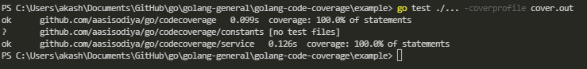
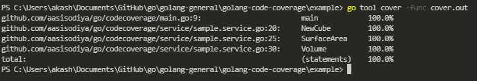

# Code Coverage in Go

- [Code Coverage in Go](#code-coverage-in-go)
  - [How to Measure Code Coverage](#how-to-measure-code-coverage)
    - [`go test -cover .` Command](#go-test--cover--command)
    - [`go test ./... -coverprofile cover.out` Command](#go-test---coverprofile-coverout-command)
    - [`go tool cover -func cover.out` Command](#go-tool-cover--func-coverout-command)

Code Coverage helps you to validate your code, it helps a lot when you make incremental changes and need to make sure that all previous functionality are indeed intact. In GO also you can write code for code coverage and calculate the same.

## How to Measure Code Coverage

| Command                                 | Description                                                           |
| --------------------------------------- | --------------------------------------------------------------------- |
| `go test -cover .`                      | Gets basic coverage statistics for a single package                   |
| `go test ./... -coverprofile cover.out` | Creates Cover Profile for overall code coverage for multiple packages |
| `go tool cover -func cover.out`         | Gives you code coverage for every single package withing your project |
| `go test -coverprofile=cover`           | Gives you a coverage profile, then use below command to read it       |
| `go tool cover -html=cover`             | Gives you code coverage in HTML File                                  |

### `go test -cover .` Command

`go test -cover .` command will only give you basic coverage statistics for a single package. That is if you run this command in package `service` it will only calculate coverage for `service` package.

### `go test ./... -coverprofile cover.out` Command

`go test ./... -coverprofile cover.out` command will give you the overall code coverage for multiple packages. Run it from main package folder location.

### `go tool cover -func cover.out` Command

`go tool cover -func cover.out` command will give you the code coverage for every single function/method in a package withing your project.

> For demo purpose you can use [this code](https://github.com/aasisodiya/go/tree/master/golang-general/golang-code-coverage/example)
