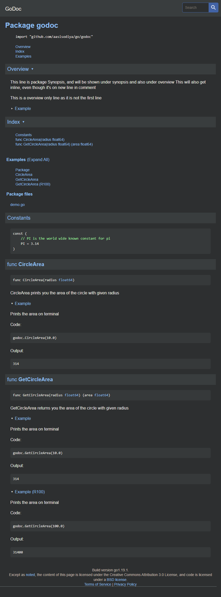

# Documenting Code Using `godoc`

- [Documenting Code Using `godoc`](#documenting-code-using-godoc)
  - [Sample Code](#sample-code)
  - [Go Doc](#go-doc)
  - [Reference](#reference)

I will be explaining an example taken with reference from [Godocs - Effortless documentation for your go packages](https://www.youtube.com/watch?v=80VT3xexcWs) by [Leetware](https://www.youtube.com/channel/UC_hv2IPy6vSLAJkJnOSsOrw). Source code can be found at [Github](https://github.com/aasisodiya/go/tree/master/golang-godoc).

Let's start

## Sample Code

First of all the godoc example is written for a shared package `godoc` and not for `package main`

```go
module github.com/aasisodiya/go/godoc

go 1.19
```

Below you can see some comments above `package godoc`. The first line of the comment will be shown under synopsis and overview. And any line that is written after a new line in between will only appear in overview block.

Also the respective comments for the variable, functions, constants, struct and so on will be part of the godoc.

```go
// This line is package Synopsis, and will be shown under synopsis and also under overview
// This will also get inline, even though it's on new line in comment
//
// This is a overview only line as it is not the first line
package godoc

import "fmt"

const (
    // PI is the world wide known constant for pi
    PI = 3.14
)

// GetCircleArea returns you the area of the circle with given radius
func GetCircleArea(radius float64) (area float64) {
    area = PI * radius * radius
    fmt.Println(area)
    return
}

// CircleArea prints you the area of the circle with given radius
func CircleArea(radius float64) {
    area := PI * radius * radius
    fmt.Println(area)
}

// Command to open godoc : C:\Users\akash\go\bin\godoc.exe -http=:6060
```

You can also specify example explaining how to use the package, this code is written under package with same name followed by suffix `_test`. As we have our package name as `godoc` hence we have used `godoc_test` as package name.

Now for writing an example of the functions you need to use `Example` as prefix before the function name. Then you can write a call to the code and display the sample output (if any) using the keyword `Output:`. You need to follow a convention, `Output:` is written in new line comment below the caller code and then followed by new line comment containing the output.

Also whatever example you write in this package also acts like test cases.

```go
package godoc_test

import "github.com/aasisodiya/go/godoc"

func Example() {
    godoc.CircleArea(10.0)
    // Output:
    // 314
}

// go test -timeout 30s -run ^Example$ github.com/aasisodiya/go/godoc

// Prints the area on terminal
func ExampleCircleArea() {
    godoc.CircleArea(10.0)
    // Output:
    // 314
}

// go test -timeout 30s -run ^ExampleCircleArea$ github.com/aasisodiya/go/godoc

// Prints the area on terminal
func ExampleGetCircleArea() {
    godoc.GetCircleArea(10.0)
    // Output:
    // 314
}

// go test -timeout 30s -run ^ExampleGetCircleArea$ github.com/aasisodiya/go/godoc

// ! This below example won't show up in doc as after _ you need lowercase
// Prints the area on terminal
func ExampleGetCircleArea_R100() {
    godoc.GetCircleArea(100.0)
    // Output:
    // 31400
}

// go test -timeout 30s -run ^ExampleGetCircleArea_R100$ github.com/aasisodiya/go/godoc

// Prints the area on terminal
func ExampleGetCircleArea_r100() {
    godoc.GetCircleArea(100.0)
    // Output:
    // 31400
}

// go test -timeout 30s -run ^ExampleGetCircleArea_r100$ github.com/aasisodiya/go/godoc
```

## Go Doc

> If `godoc` doesn work, refer [this link](https://aasisodiya.github.io/go/golang-general/golang-basics/#documenting-go-code-with-godoc)

Now for viewing the godoc, you have to open the command terminal and run command `C:\Users\akash\go\bin\godoc.exe -http=:6060`, btw here I have used the path where `godoc.exe` is kept. So you might have to update and use it accordingly, or you can use `godoc -http=:6060`. After running this command, you will have to open [this link: http://localhost:6060/pkg/](http://localhost:6060/pkg/) in web browser.

This will open Go Documentation Server as shown below


Now from here click on `Third Party` link, this show you your package's synopsis as shown below


From here click on your package name i.e. `godoc` and this will open documentation for your package `godoc` as shown below.



## Reference

- [Godocs - Effortless documentation for your go packages](https://www.youtube.com/watch?v=80VT3xexcWs)
