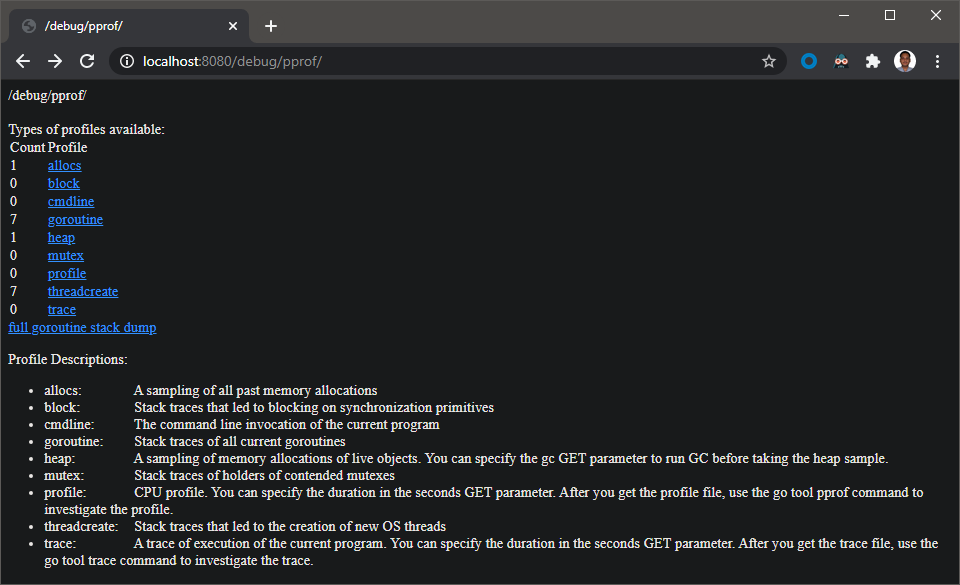
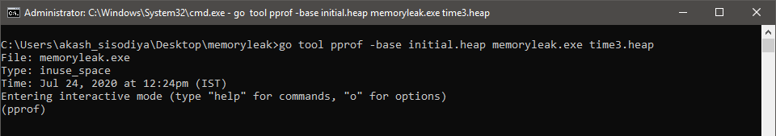
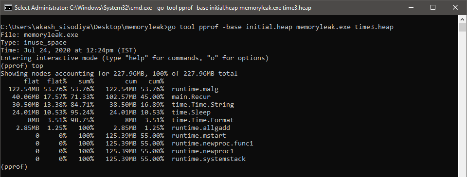
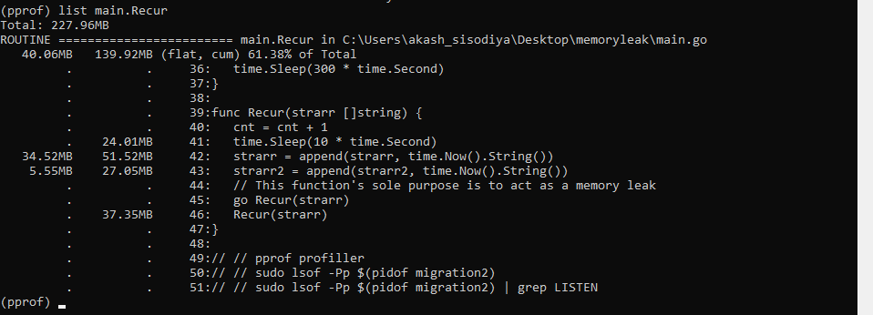
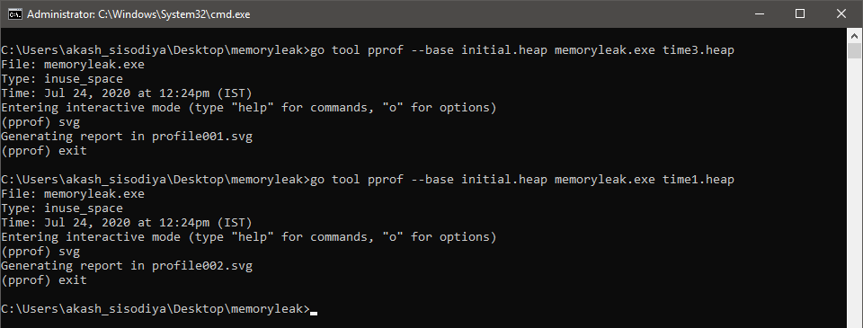
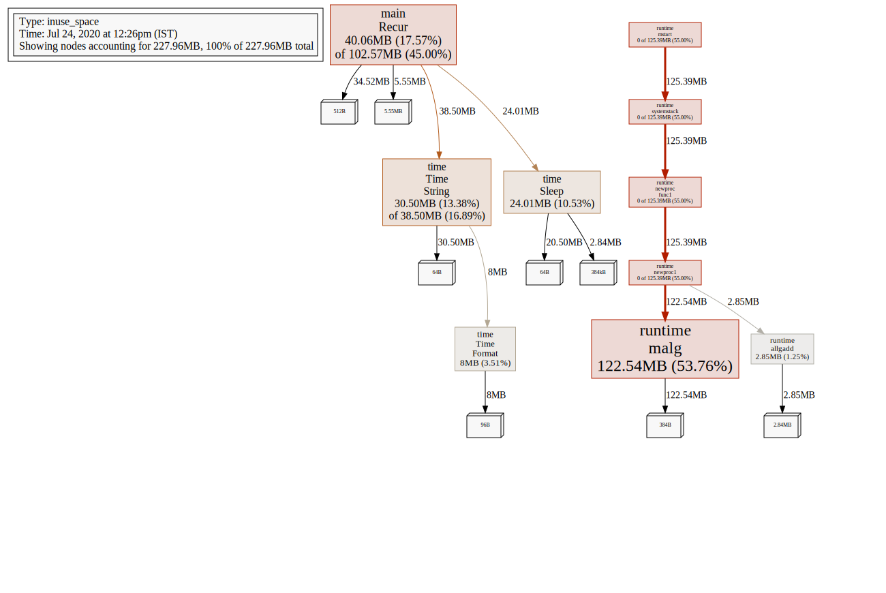

# Memory Leaks in Go Lang

## Memory Leaks

Memory Leaks happens when memory is not released even after it is no longer needed by a program. In most cases memory consumption by a program keeps on growing and then crashes the program, thus impacting the performance. **WARNING!!!!!! If you run below given sample code more than 5 minutes by changing the time frequency it might crash your system**

## Steps to Analyse Memory Leaks in Go Lang

To analyse Memory Leaks in our Go Code, [pprof](https://golang.org/pkg/net/http/pprof/) package is very useful. Below are in short steps

1. Integrate `pprof` package
1. Build and Run the code
1. Save Heap Profile for different time intervals
1. Compare/Analyze the profile to find the leak

### pprof

`pprof` is a sampling profiler so it only tracks a small percentage of allocations and approximates real counts. You can profile a running process without affecting its behavior.

Command to find out if a process already has profiling endpoint exposed

```bash
lsof -Pp $(pidof myprocess) | grep LISTEN
```

If profiler is not configured then below are two main line of code that you will have to use

```go
import _ "net/http/pprof"
// And
http.ListenAndServe(":8080", nil)
```

Below here I have created a simple code block so just Copy below code and paste it in your go code accordingly.

```go
// Integrate below init() function properly in your code, plain copy-paste might cause issues so be careful
func init() {
  runtime.GOMAXPROCS(8)
  // Define a profilerURL for your program to use | you might sometime have to use different port if 8080 is not available
  profilerPort := ":8080"
  go func() {
    err := http.ListenAndServe(profilerPort, nil)
    if err != nil {
      fmt.Println("Error with ListenAndServe: ", profilerURL, err.Error())
      os.Exit(1)
    }
  }()
}
```

for above code to work you will need following imports

```go
import(
  "net/http"
  _ "net/http/pprof"
)
```

Sample Code that I am using in this example

```go
package main

import (
  "fmt"
  "log"
  "net/http"
  _ "net/http/pprof"
  "os"
  "runtime"
  "time"
)

var cnt int
var strarr2 []string

// Integrate below init() function properly in your code, plain copy-paste might cause issues so be careful
func init() {
  runtime.GOMAXPROCS(8)
  // Define a profilerURL for your program to use | you might sometime have to use different port if 8080 is not available
  profilerPort := ":8080"
  go func() {
    err := http.ListenAndServe(profilerPort, nil)
    if err != nil {
      fmt.Println("Error with ListenAndServe: ", profilerPort, err.Error())
      os.Exit(1)
    }
  }()
}

func main() {
  log.Println("Memory Leak Test Program")
  var strarr []string
  cnt = 0
  go Recur(strarr)
  // Just to allow program to keep running and call above go routine recur()
  time.Sleep(300 * time.Second) //Don't change this, It may crash your system
}

// Recur is the recursive function
func Recur(strarr []string) {
  cnt = cnt + 1
  time.Sleep(30 * time.Second) //Don't change this, It may crash your system
  strarr = append(strarr, time.Now().String())
  strarr2 = append(strarr2, time.Now().String())
  // This function's sole purpose is to act as a memory leak
  go Recur(strarr)
  Recur(strarr)
}
```

Now build and run your code. If everything goes well you will have a webpage at `http://localhost:8080/debug/pprof/`. Now you can use this website to Analyse the Memory Leak.



But in case you're on AWS EC2 Linux Machine this won't work. So below are steps on how to analyse the same using terminal.

## Analyzing the Issue

### Saving the Heap Profile

For analyzing the issue we are going to need a heap profile, so lets create some

First command that you will run, is for creating an initial heap for comparison. *We will run this when the program starts*

```bash
curl -s http://localhost:8080/debug/pprof/heap > initial.heap
# OR
curl -s http://localhost:8080/debug/pprof/heap > /path/to/your/initial.heap
```

Then you can run below command for creating a heap for comparison at different interval of time

```bash
curl -s http://localhost:8080/debug/pprof/heap > time1.heap
# OR
curl -s http://localhost:8080/debug/pprof/heap > /path/to/your/time1.heap
```

Now you have two profile for comparison. Now Compare two profiles to find the memory leaks. `-base /path/to/heap.profile` allows you to compare current profile with some base profile.

```bash
go tool pprof -base initial.heap yourExecutableGoProgramName time1.heap
# OR
go tool pprof -base /path/to/your/initial.heap yourExecutableGoProgramName /path/to/your/time1.heap
```

- Use `-inuse_space` mode when you want to display an amount of memory in use
- Use `-inuse_objects` mode when you want to display a number of objects in use

```cmd
go tool pprof -inuse_objects --base initial.heap yourExecutableGoProgramName time1.heap
# OR
go tool pprof -inuse_objects --base /path/to/your/initial.heap /path/to/your/ExecutableGoProgramName /path/to/your/time1.heap
```

> yourExecutableGoProgramName is optional but in case you want to pin point the line of code where the underlying issue is, then you will have to pass it as an argument

You can also use below command to analyse a specific heap

```cmd
go tool pprof time1.heap
# OR
go tool pprof /path/to/your.heap
```

In case above steps seems lengthy, you always have another way to straight dive into the heap using below command

```cmd
go tool pprof http://localhost:8080/debug/pprof/heap
```

### Analyzing the Heap Profile

When you run different `go tool pprof` commands it will open a new view as shown below



Now you can use following commands for mentioned purpose

|Command|Description|
|-------|-----------|
|`top`|Shows you the top allocations|
|`topn`|Replace n with any number and it will give you top n allocations ex. `top5` will give you top 5 allocations|
|`list`|Shows annotated source (i.e basically the line of code) along with memory occupied by it|
|`web`|Displays profile graph in a browser. *Won't work on EC2 Linux Instance*|
|`svg`|Generate profile graph and save it to svg format file. You will have to use this on ec2 instead of `web` command|

#### `top` & `topn` command

Using `top` and `topn` will give you top allocations where `topn` will just list top n allocations. In below screenshot you can see memory allocations by respective components.



So on analyzing we can see an issue with `main.Recur`. But where's the issue in it? for that we will `list` command

#### `list` command

`list` command on its own won't work, you have to specify the object that you want to analyse. In our case we want to further look into `main.Recur` so we will use command `list main.Recur` as shown below



Now we can clearly spot the line of code with issue and start to work on resolving it.

#### `svg` and `web` command

`svg` command helps you to Generate profile graph in svg file format. Which you can use to visualize the issue.



The generated profile graph looks like given below



[View Full SVG Graph](img/graph.svg)
<!--  -->

You can clearly identify the root cause from here based on the size of node and work to fix it.

`web` commands is just the shortcut way of generating the graph and opening it in your default web-browser. But this doesn't work on AWS EC2 Linux Machine Terminal

---

## Troubleshooting

- **Problem:** Facing issue `graphviz's executables not found` while running `web` command in `pprof`

  **Solution:** Download from given [link](https://www2.graphviz.org/Packages/stable/windows/10/msbuild/Release/Win32/). After downloading this make sure to update environment variables as well, else it won't work.

## Reference

- [Finding Memory Leaks in Go Programs - Oleg Shaldybin](https://www.youtube.com/watch?v=ydWFpcoYraU)
- [Profiling Your Go Programs (Episode 8)](https://www.youtube.com/watch?v=7LCgsfHlMv4)
